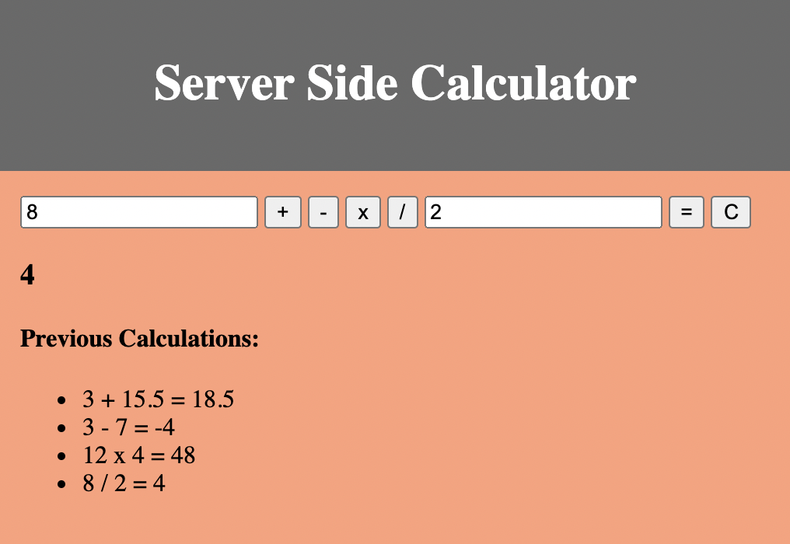

# Server Side Calculator

## Description
---

Duration: 2 days

I created an application that takes in two numbers and performs a calculation.

To accomplish this, I first created a basic html application layout with two input fields, buttons for addition, subtraction, multiplication and division, an equals button, a 'C' button, an area to display the result from the current calculation and an area to display a list of previous calculations. I then added functionality on the client side to capture the input number values and the selected operation sign on the click of the '=' button. I then routed that information to be bundled and sent to the server side. Next, on the server side, I created a function to perform a calculation based on the information that was received. Then I created a function to bundle the input numbers, operator and answer in an object and then pushed that object to an array. Next, I wired that information to be sent to the client side and there I created a function to display the result of the current calculation and a history of all the previous calculations. Lastly, I created a function on the client side to clear the input number fields on the click of the 'C' button.

## Screen Shot
---

## Usage
---
1. Enter a number into each input field and select the desired operator.

2. Click the '=' button to perform the calculation and to have the result displayed beneath the input fields. All previous calculations and their results will be listed under 'Previous Calculations'.

3. To clear the input fields, click the 'C' button.

## Built With
---
- HTML
- CSS
- JavaScript
- jQuery
- Node.js
- Express.js

## Acknowledgment
---
Thank you to Prime Digital Academy, my instructor and my classmates who equipped and helped me to make this application.